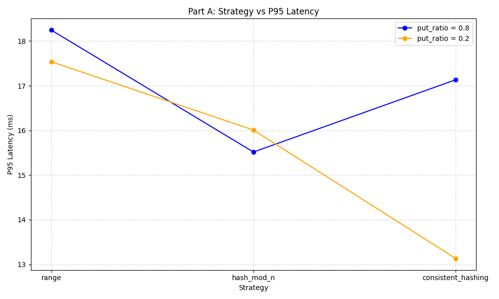
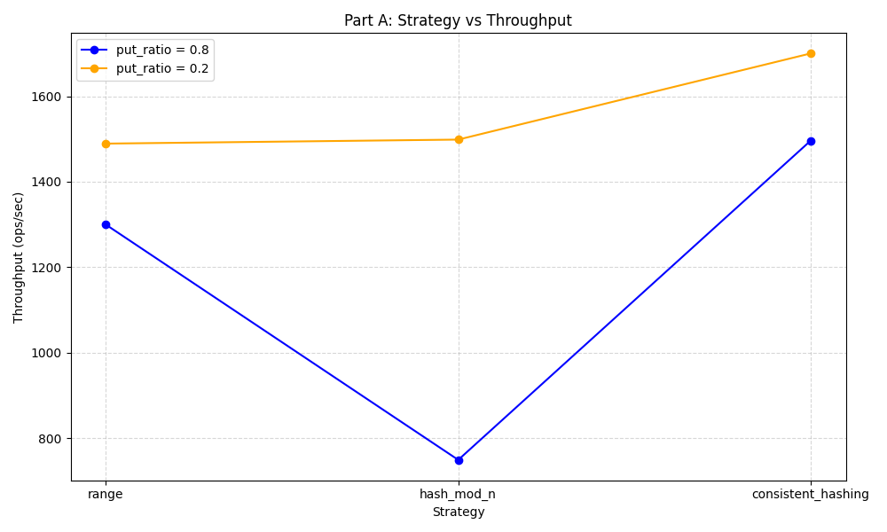
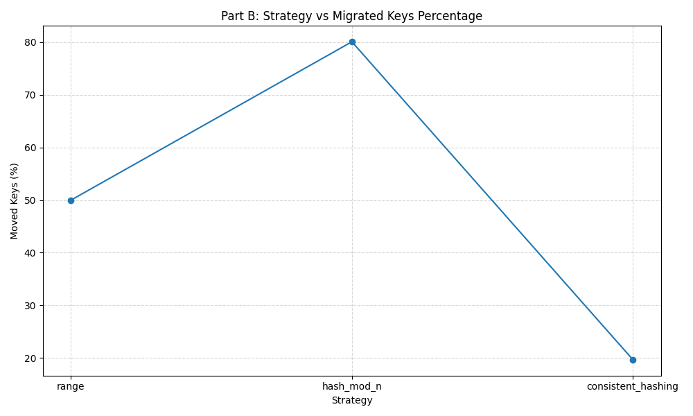
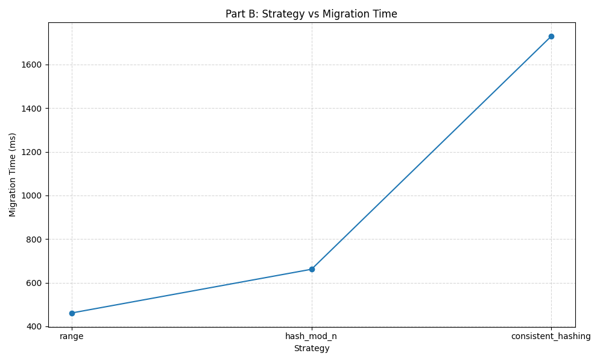
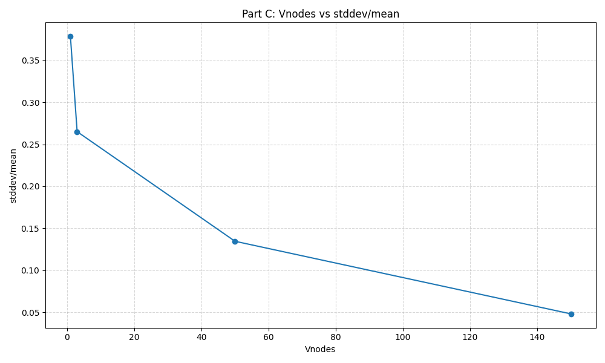

# Benchmark report

## 1. Все прогоны

### 1.1 Сравнение стратегий шардирования в плане производительности

| strategy           | put_ratio | keys |  ops | threads | throughput_ops_sec | latency_avg_ms | latency_p50_ms | latency_p95_ms | latency_p99_ms |
|--------------------|----------:|-----:|-----:|--------:|-------------------:|---------------:|---------------:|---------------:|---------------:|
| range              |       0.8 | 2000 | 2000 |      16 |            1299.74 |          12.01 |          11.01 |          18.25 |          33.50 |
| range              |       0.2 | 2000 | 2000 |      16 |            1489.16 |          10.48 |           9.48 |          17.54 |          24.18 |
| hash_mod_n         |       0.8 | 2000 | 2000 |      16 |             749.20 |          21.04 |           9.68 |          15.52 |          57.19 |
| hash_mod_n         |       0.2 | 2000 | 2000 |      16 |            1498.53 |          10.47 |           9.55 |          16.01 |          28.67 |
| consistent_hashing |       0.8 | 2000 | 2000 |      16 |            1496.14 |          10.53 |           9.42 |          17.13 |          27.16 |
| consistent_hashing |       0.2 | 2000 | 2000 |      16 |            1700.14 |          10.54 |           9.42 |          13.13 |          19.16 |

### 1.2 Сравнение стратегий шардирования в миграций

| strategy           |  keys |   ops | threads | moved_keys_percent | migration_time_ms |
|--------------------|------:|------:|--------:|-------------------:|------------------:|
| range              | 10000 | 10000 |      16 |              49.99 |            461.67 |
| hash_mod_n         | 10000 | 10000 |      16 |              80.06 |            661.81 |
| consistent_hashing | 10000 | 10000 |      16 |              19.70 |           1729.08 |

### 1.3 Закономерность VNodes vs равномерность

| strategy           | Vnodes |  keys |   ops | threads | stddev | stddev/mean | max/avg |
|--------------------|-------:|------:|------:|--------:|-------:|------------:|--------:|
| consistent_hashing |      1 | 10000 | 10000 |      16 | 756.96 |      0.3785 |  1.4840 |
| consistent_hashing |      3 | 10000 | 10000 |      16 | 530.25 |      0.2651 |  1.3615 |
| consistent_hashing |     50 | 10000 | 10000 |      16 | 268.97 |      0.1345 |  1.1630 |
| consistent_hashing |    150 | 10000 | 10000 |      16 |  95.93 |      0.0480 |  1.0825 |

---

## 2. Графики

### 2.1 График strategy vs latency


### 2.2 График strategy vs throughput


### 2.3 График strategy vs moved keys percent


### 2.4 График strategy vs migration time ms


### 2.5 График vnodes vs stddev/mean


---

## 3. Краткое объяснение результатов


### 3.1 Почему `hash_mod_n` создаёт катастрофическую ребалансировку

В стратегии `hash_mod_n` владелец ключа определяется по формуле:

```text
nodeIndex = hash(key) % N
```

где `N` — текущее количество узлов в кластере.

Проблема в том, что при добавлении или удалении узла меняется `N`, а значит меняется результат формулы для большинства ключей.

Например, было:

```text
hash(key) % 4
```

а после добавления узла стало:

```text
hash(key) % 5
```

Даже если сам `hash(key)` не изменился, остаток от деления на `4` и на `5` обычно будет разным. Поэтому большая часть ключей должна переехать на другие узлы.

В результате при добавлении 5-го узла в кластер из 4 узлов может мигрировать около `80%` данных. Это и называется катастрофической ребалансировкой: изменение кластера небольшое, но перемещается почти весь набор данных.

### 3.2 Почему `consistent_hashing` перемещает примерно `1/N` данных

В `consistent_hashing` все узлы располагаются на хэш-кольце. Ключ тоже хэшируется и назначается ближайшему следующему узлу на кольце.

Когда в кластер добавляется новый узел, он занимает только один участок кольца. Ему переходят только те ключи, которые раньше принадлежали соседнему узлу справа.

Остальные ключи остаются на своих местах.

Если после добавления стало `N` узлов, то новый узел в среднем получает примерно:

```text
1 / N
```

всего пространства ключей.

Например, если добавляется 5-й узел, то ожидаемая доля мигрированных ключей:

```text
1 / 5 = 20%
```

Поэтому `consistent_hashing` хорошо подходит для динамических кластеров, где узлы могут часто добавляться или удаляться.

### 3.3 Как `vnodes` влияют на равномерность и почему

Если у каждой физической ноды только одна точка на кольце, то распределение может быть неравномерным. Одна нода может случайно получить большой сектор кольца, а другая — маленький.

Из-за этого часть нод будет хранить слишком много ключей, а часть — слишком мало.

`vnodes` решают эту проблему. Вместо одной точки на кольце каждая физическая нода получает несколько виртуальных точек.

Например:

```text
5 физических нод
V = 1   -> всего 5 точек на кольце
V = 150 -> всего 750 точек на кольце
```

Чем больше виртуальных точек, тем лучше они перемешиваются по кольцу. Сектора становятся меньше, и итоговая нагрузка на физические ноды становится более равномерной.

Поэтому при увеличении `V` уменьшаются метрики разброса:

```text
stddev/mean
max/avg
```

Это означает, что распределение ключей становится ближе к идеальному.

Однако слишком большое число `vnodes` тоже имеет минус: кольцо становится больше, его тяжелее хранить, строить и пересчитывать при изменениях кластера.

### 3.4 В каких сценариях `range-based` лучше

`range-based` шардирование лучше всего подходит для случаев, когда важен порядок ключей.

Например, если ключи имеют вид:

```text
user:00001
user:00002
...
user:10000
```

то запрос диапазона:

```text
rangeGet user:02000 user:03000
```

можно обработать эффективно, потому что Router понимает, какие диапазоны ключей лежат на каких узлах.

Также `range-based` удобно использовать для `data locality`, то есть для хранения связанных данных рядом.

Например:

```text
orders:user:123:*
logs:2026-05-03:*
region:eu:*
```

Если грамотно подобрать границы, связанные ключи будут лежать на одном узле или на небольшом числе соседних узлов. Это удобно для аналитики, сканов, range-запросов и локальной обработки данных.

Главный минус `range-based` — необходимость вручную выбирать хорошие границы. Если границы выбраны плохо, распределение может стать сильно неравномерным.

Например:

```text
setRanges m z
```

и ключи:

```text
user:00001
user:00002
...
user:10000
```

Так как `user:*` находится между `m` и `z`, почти все ключи попадут в один диапазон и окажутся на одной ноде.